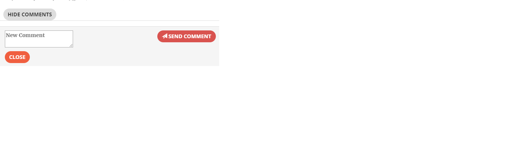

# Citizen Engagement Project
DFA Project - MAS-RAD - Web application allowing a citizen to report problems encountered in the streets of Yverdon-les-Bains

 

This repository contains the source code for the Cityzen Engagement Application for the project of DFA (MAS-RAD). 
Citizen Engagement is an application inviting citizens to notify issues they encounter in the city of Yverdon-les-Bains so that 
they can be solved.

In this README you'll find the functionalities of this application.

1. [Welcome page](#welcome)
2. [Register](#register)
3. [Login](#login)
4. [Main menu - NavBar](#main-menu)
5. [Last 10 Issues view](#lastIssues)
6. [Create a new issue](#newIssue)
7. [All Issues](#allIssues)
 * [Filter by issue type](#issueType)
 * [Filter by text](#text)
 * [Issue Details](#issueDet)
8. [Issue Details](#issueDetails)
 * [Comments](#comments)
 * [Tags](#tags)

## 1. Welcome Page

When the application is first started, the user is redirected to the Welcome Page where he gets to know the concept of the application and also how it works (at the bottom of the page the user can register /login):

<a href="#top">go up</a>

## 2. Register

At the bottom of the Welcome page the user can find the option to Register or Login (if already registered)

If the user choses the register option by clicking the button "Register", he's asked to entre his first and last names, a username ans a password and then click on the register button of this screen:

The user registration is successful if he's redirected to the Login page (see below)

<a href="#top">go up</a>

## 3. Login

In the login view the user is asked to enter his username and password to be identified in the application. 
If the provided information is not correct, the user will be informed with a message, otherwise the user will be connected to the application and redirected to the home page of the application.

<a href="#top">go up</a>

## 4. Main menu

By clicking the navbrand  the user will be redirected to the Welcome Page

The other options (from the left to right) are:

- Home page : with a list of the last reported issues
- Option to create a new issue
- Option to see all issues
- logout option

<a href="#top">go up</a>

## 5. Last 10 Issues

In the view the user will be able to see the last 10 reported issues and a map containing all issues

<a href="#top">go up</a>

## 6. Create a new issue

<a href="#top">go up</a>

## 7. All Issues

<a href="#top">go up</a>

### 7.1 Filter by Issue Type

<a href="#top">go up</a>

### 7.2 Filter by text

<a href="#top">go up</a>

### 7.3 How to see the details of an issue

<a href="#top">go up</a>

## 8. Issue details modal

<a href="#top">go up</a>

### 8.1 Issue comments

<a href="#top">go up</a>

### 8.2 Issue tags

<a href="#top">go up</a>

