# Citizen Engagement Project
DFA Project - MAS-RAD
A Web application allowing a citizen to report problems encountered in the streets of Yverdon-les-Bains

 

This repository contains the source code for the Cityzen Engagement Application for the project of DFA course (MAS-RAD). 
Citizen Engagement is an application inviting citizens to notify issues they encounter in the city of Yverdon-les-Bains so that 
they can be solved.

In this file you'll find the functionalities of this application.

1. [Welcome page](#welcome)
2. [Register](#register)
3. [Login](#login)
4. [Main menu - NavBar](#main-menu)
5. [Last 10 Issues view](#lastIssues)
6. [Create a new issue](#newIssue)
7. [All Issues](#allIssues)
 * [Filter by issue type](#issueType)
 * [Filter by text](#text)
 * [Issue Details](#issueDet)
8. [Issue Details](#issueDetails)
 * [Comments](#comments)
 * [Tags](#tags)

## 1. Welcome Page

When the application is first started, the user is redirected to the Welcome Page where he gets to know the concept of the application and also how it works (at the bottom of the page the user can register /login):

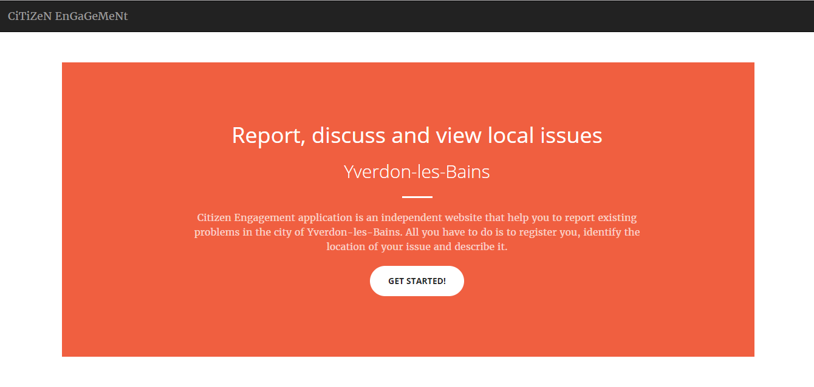

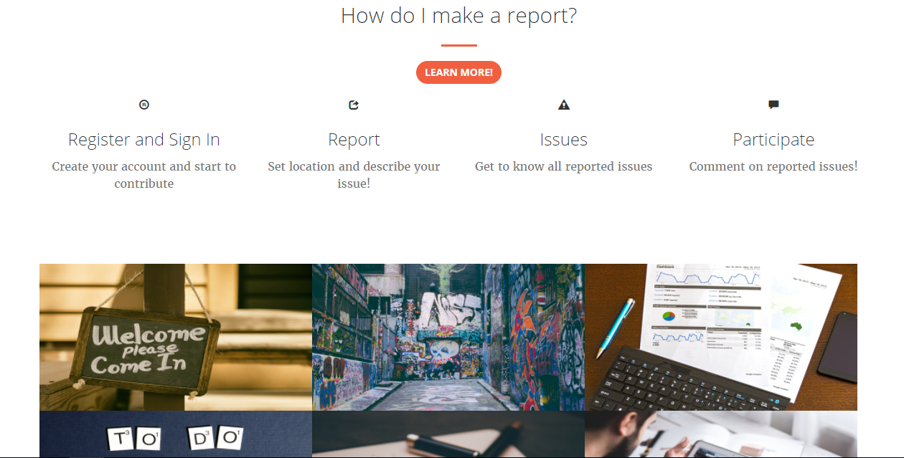

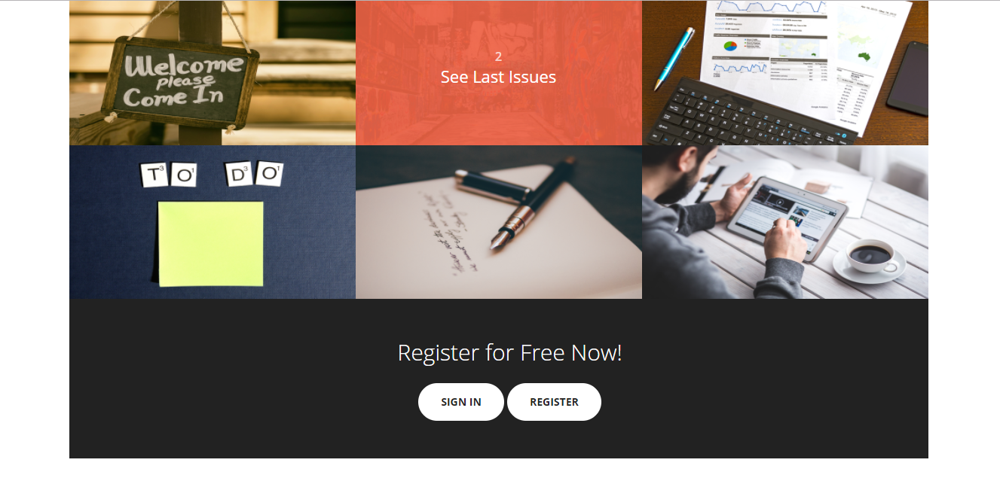

<a href="#top">go up</a>

## 2. Register

At the bottom of the Welcome page the user can find the option to Register or Login (if already registered)

If the user choses the register option by clicking the button "Register", he's asked to enter his first and last names, an username and a password. Then he has to click on the register button of this screen:

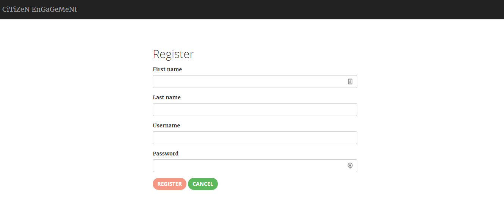

The user registration is successful if he's redirected to the Login page (see below)

<a href="#top">go up</a>

## 3. Login

In the login view the user is asked to enter his username and password to be identified in the application. 
If the provided information is not correct, the user will be informed with a message, otherwise the user will be connected to the application and redirected to the home page of the application.

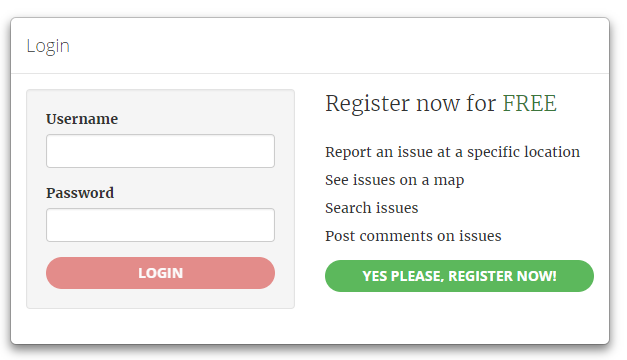

<a href="#top">go up</a>

## 4. Main menu

By clicking the navbrand 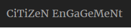 the user will be redirected to the [Welcome page](#welcome)

The other options (from the left to right) are:

- Home page : with a list of the last reported issues
- Option to create a new issue
- Option to see all issues
- logout of the application

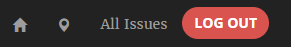

<a href="#top">go up</a>

## 5. Last 10 Issues

In this view the user will be able to see the last 10 reported issues and a map containing all the reported issues.

The user also can click on an issue an will be redirected to the issue details ([Issue Details](#issueDetails)).

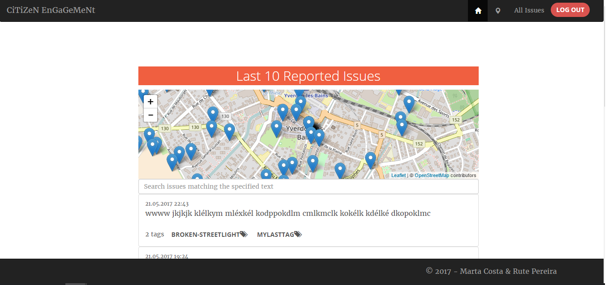

<a href="#top">go up</a>

## 6. Create a new issue

To create a new issue the user has to chose the option 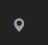 of the main menu.

He will be then redirected to the "create new issue" view (image below):
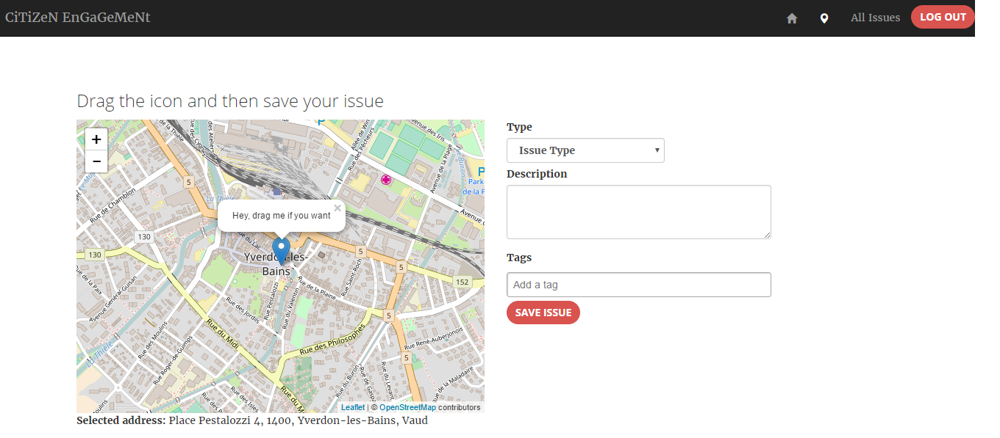

To create a new issue the user has to:

1. drag the icon to the right place (new issue coordinates). On dropping the icon the new adress will be indicated below the map to help the user to be sure he's chosing the rigth place
3. chose an issue type from the given options
4. write a description of the issue
5. add tags (optional)
6. click the button "Save Issue"

In the end the user will be redirected to the home page and a confirmation message of issue creation will appear.

<a href="#top">go up</a>

## 7. All Issues

To see all reported issues, the user has to chose the option "All Issues" of the main menu.

Here, he will see all the reported issues in the map and also a list of all issues (description and tags visible).

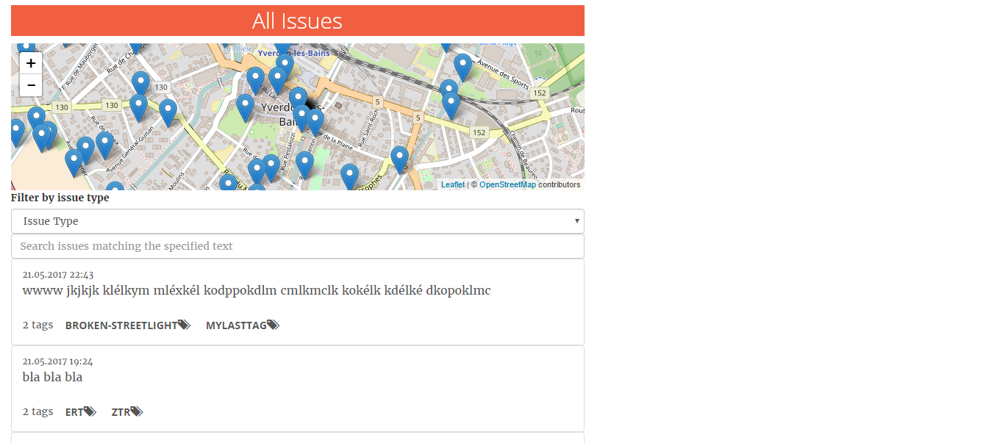

From here the user can:

- see an issue details (by clicking that issue) [Issue Details](#issueDet)
- filter list by issue type [Filter by issue type](#issueType)
- filter list by word [Filter by text](#text)

<a href="#top">go up</a>

### 7.1 Filter by Issue Type

To filter by issue type the user just has to chose the issue type of the given options:

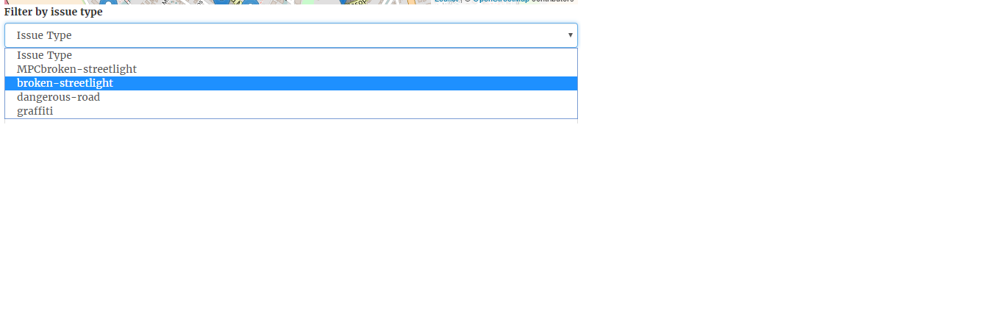

<a href="#top">go up</a>

### 7.2 Filter by text

To filter by word the user just has type the searched word:

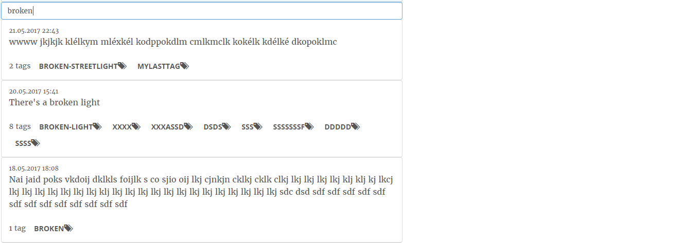

<a href="#top">go up</a>

### 7.3 How to see the details of an issue

By clicking on a issue item of the issues list the user will be redirected to the detailed information of that issue:

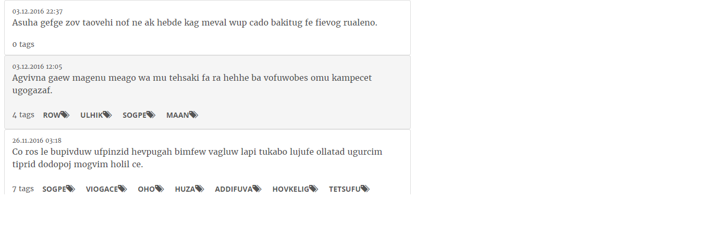

<a href="#top">go up</a>

## 8. Issue details modal

After chosing and clicking an issue item on the issues list more details will appear in a dialog (modal) view:

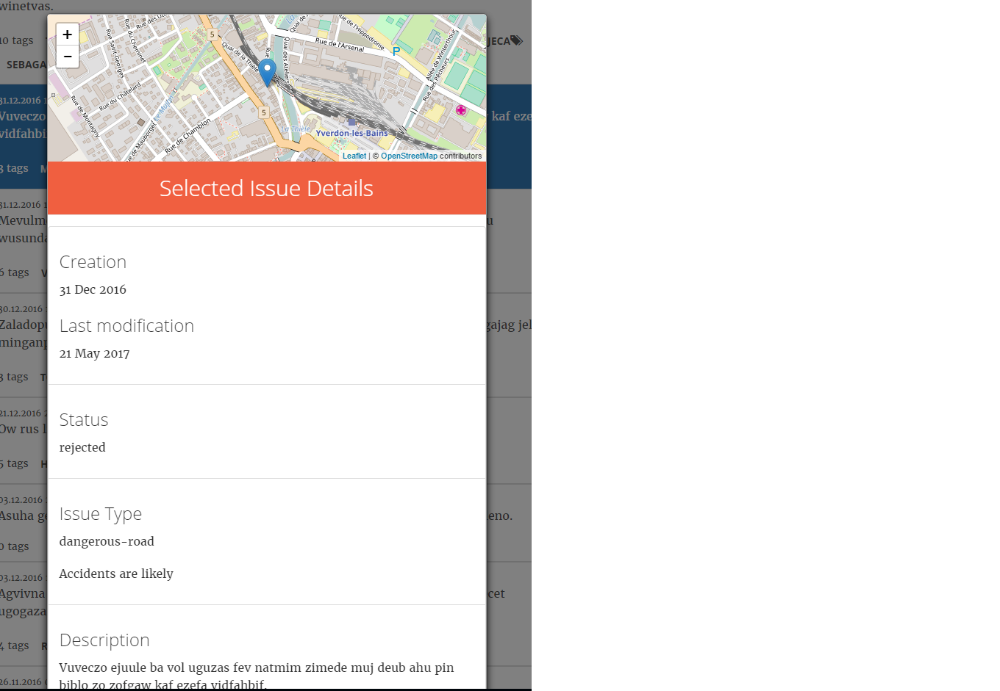

In the details dialog of an issue the user can see:

- creation date
- last modification date
- issue status
- issue type
- description
- existing tags (here he can remove or add tags [Tags](#tags))
- existing commments by clicking the button "show all comments" (here he can make a new comment(s) [Comments](#comments))

<a href="#top">go up</a>

### 8.1 Issue comments

At the below of the details dialog the user can see all existing comments and also he has the possibility of adding a new comment that will be automatically updated in the view.
To do that he just have to type his comment in the available text area and then click the button "Send Comment":

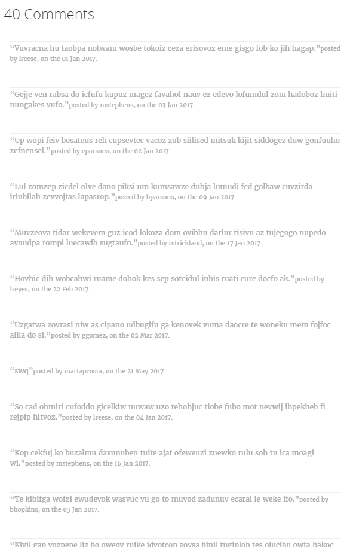

<a href="#top">go up</a>

### 8.2 Issue tags

In the details dialog of an issue the user can add or remove tags:

- to remove a tag he just has to click on the tag the he wants to delete (blue buttons)
- to add a new tag he just has to type the new tag and the tap enter or tab keyboard keys

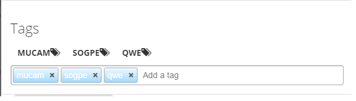

<a href="#top">go up</a>

